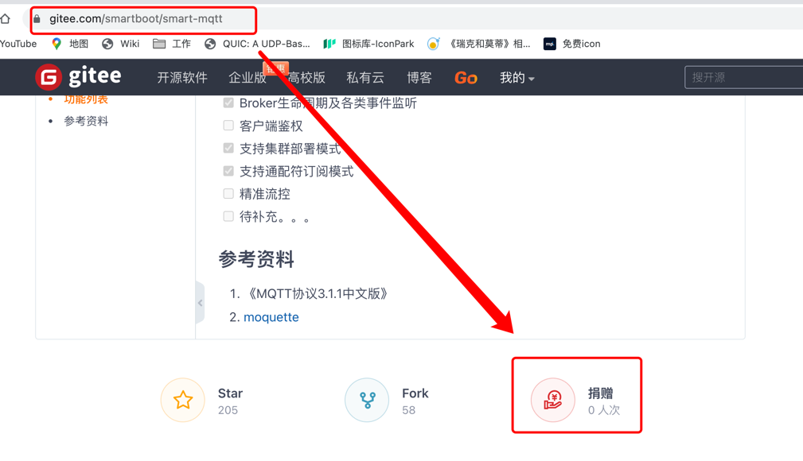

## 1. 关于企业版

smart-mqtt 是 smartboot 组织内首个尝试走商业化路线的作品。

虽然我们知道用户更喜欢免费的开源产品，况且 smart-mqtt 还很年轻，距离成熟的商业化产品还有很长一定距离。
过早的表达商业化发展路线可能会失去一部分用户，也会遭受一些非议。

而多年开源经历下来，我们看到了很多开源作者正是因为没能从开源中获得可持续的收益，最终因生活所迫无奈选择终止维护开源项目。
开源不易，我们始于热爱，敬于技术，更要忠于生活。

好的产品，本身就该成为好的商品。一个有价值的产品，理当成为一款有价格的商品。

我们预估不了 smart-mqtt 的商业化路线是否顺畅，但单从技术角度而言，一款能够承载海量物联设备互通互联的产品，一定是具备相当高的技术价值。
打造这样一款产品，要么背后有大厂支持为研发成本买单；要么依靠市场的正向反馈使其可持续迭代发展下去，而 smart-mqtt 正是后者。

### 1.1 版本对比
|                | 社区版      | 企业版                                   |
|----------------|----------|---------------------------------------|
| 授权对象           | 个人       | 企业                                    |
| 授权目的           | 技术学习     | 商业化                                   |
| 授权形式           | AGPL 3.0 | 商业化 License                           |
| MQTT/TCP       | ✅        | ✅                                     |
| MQTT/Websocket | ❌        | ✅                                     |
| Broker集群       | ❌        | ✅                                     |
| 数据持久化          | ❌        | ✅                                     |
| 数据桥接 -- redis  | ❌        | ✅                                     |
| 数据桥接 -- kafka  | ❌        | ✅                                     |
| Dashboard      | ❌        | ✅ [在线体验](http://82.157.162.230:8083/) |

### 1.2 成本估算
云产品的采购成本几乎同连接量成线性增长关系，而 smart-mqtt 本就存在性能溢出的优势，所以连接量越大，性价比越高。

| 规格                      | Saas云产品  | smart-mqtt |
|-------------------------|----------|------------|
| 1000连接/1000TPS/1000订阅   | 1.7万/年   | 3000~5000  |
| 50000连接/20000TPS/1000订阅 | 37万/年    | 5000~10000 |
| 100万连接/20万TPS/100万订阅    | 376.8万/年 | ~10万       |

:::tip 参考数据
- [阿里云](https://www.aliyun.com/product/mq4iot)
- [华为云](https://www.huaweicloud.com/pricing.html#/iothub)  
对于smart-mqtt的成本估算仅针对服务器成本，不包括 smart-mqtt 的授权采购费用。
:::

### 1.3 同类产品比较
同类产品的横向比较是一件极易得罪人的事，为避免被人冠上『碰瓷』、『蹭流量』之类污名。
此处不提供比较结论，有需要的用户请自行验证。如有需要可移步【[性能压测](/smart-mqtt/performance.html)】章节。

下面列举了个人认为比较不错的国产化产品可供各位选择：
| 项目   | 语言     | 出品方 | 地址                                                           |
|------|--------|-----|--------------------------------------------------------------|
| emqx | Erlang | EMQ | [https://github.com/emqx/emqx](https://github.com/emqx/emqx) |
|FluxMQ| Java |FluxMQ|[https://www.fluxmq.com/](https://www.fluxmq.com/)|
|mica-mqtt| Java |如梦技术 |[https://gitee.com/596392912/mica-mqtt](https://gitee.com/596392912/mica-mqtt)|
|   BifroMQ   | Java   |   百度  | [https://github.com/baidu/bifromq](https://github.com/baidu/bifromq)                         |

> 如果不希望出现在上述列表，可联系本人将其下线。

### 1.4 赞助
> 本活动将于 2024-01-01 下线

smart-mqtt 在正式推出商业化产品之前，会为该项目的赞助商客户提供免费的 smart-mqtt 企业版授权。
同时为了感谢赞助商对本项目的早期支持，此类用户有机会享受与原赞助金额相同的 License 价格福利。

**赞助等级**

|| 青铜赞助商      | 白银赞助商 | 黄金赞助商 | 铂金赞助商  |
|------------|-------|-------|--------|----------|
| 赞助条件       |[加入企业支持计划](/smart-mqtt/)|500元/年| 1500元/年  |5000元/年 |
| License有效期 | 1年    | 1年    | 1 年    | 1年       |
| 部署指导       | ❌     | 1次     | 1次     | 不限次数     |
| `赞助商`Logo展示位 | ❌     | 小号    | 中号     | 大号       |
| 首页Logo展示位  | ❌     | ❌     | ❌      | ✅        |
| 技术支持       | 文档    | 邮件/[ISSUE](https://gitee.com/smartboot/smart-mqtt/issues)    | 微信/QQ/邮件 | 微信/QQ/邮件 |
白银赞助商的价值：

- 投入成本：500元/年，大概是一名初中级程序员一天的薪资。
- 产出效益：
    - 增加品牌曝光率。
    - 节省投入在 Sass云服务中的巨额资费。
    - 结交更多物联网领域的从业者。

::: tip
建议企业用户选择白银赞助商，性价比最高。

若是选择黄金赞助商或者铂金赞助商以示对作者开源事业的鼓励和支持，则万分感谢。
:::

- 铂金赞助商

- 黄金赞助商

- 白银赞助商
::: cardList 3
```yaml
- name: 武汉睿友科技有限公司
  desc: ""
  bgColor: '#718971'
  textColor: '#fff'
  avatar: ./img/backers/whrykj.png
```
:::

**如何赞助**
1. [邮件](mailto:zhengjunweimail@163.com)沟通赞助相关事宜。
2. 访问 smart-mqtt 项目Gitee地址：[https://gitee.com/smartboot/smart-mqtt](https://gitee.com/smartboot/smart-mqtt)，下拉页面至`捐赠`处。
   
3. 在弹出的捐赠页面中输入与赞助等级相对应的金额，并备注赞助信息。
   
4. 邮件发放授权License及企业版程序。

## 2. 快速启动

### 2.1 体验版


### 2.2 正式版

### 获得授权凭证
对于获得smart-mqtt企业版使用授权资格的用户，我们会为发放一份名为：`License.shield`的授权文件。
通过该文件，可以开启smart-mqtt企业版的各项高级特性。
::: warning 温馨提示
获得授权资格的企业有义务，也有责任妥善保管该授权文件。
若出现违规行为致使非授权对象使用了企业版功能，将被列入黑名单且不再允许使用smartboot相关技术和产品。
:::

### 下载企业版发行包
对于已获得授权资格的企业客户，我们会为其开放 **smart-mqtt企业版发行包** 的下载权限。

建议下载最新版本的jar包，并连同`License.shield`上传至待部署的服务器。


### 调整配置文件
示例：
```yaml
broker:
  port: 1883
  host: 10.0.24.4
  threadNum: 16
  maxInflight: 8
  retryInterval: 30
  connect:
    idleTimeout: 5000

plugins:
  - enterprise:
      metric:
        enable: true
        period: 5
      openapi:
        enable: true
        port: 8083
        host: 10.0.24.4
      cluster:
        enable: true
        localAddress: mqtt://${current_node}:1883
        nodes:
          - mqtt://${node_1}:1883
          - mqtt://${node_2}:1883
          - mqtt://${node_3}:1883
          - mqtt://${node_4}:1883
  - database:
      dbType: mysql
      url: jdbc:mysql://${host}:${port}/smart_mqtt?autoReconnect=true
      username: ${username}
      password: ${password}
  - websocket:
      port: 1884
```
### 启动服务
待配置文件调整完毕后， 执行以下命令启动 smart-mqtt，需根据实际情况调整`${version}`值。
```shell
nohup java -Dlicense=License.shield \
  -DbrokerConfig=smart-mqtt.yaml \
  -jar  smart-mqtt-broker-enterprise-${version}.jar &
```
若启动成功，执行`tail -f nohup.out` 将会看到以下信息：
```shell
                               _                         _    _       _                  _                  
                              ( )_                      ( )_ ( )_    ( )                ( )                 
  ___   ___ ___     _ _  _ __ | ,_)     ___ ___     _ _ | ,_)| ,_)   | |_    _ __   _   | |/')    __   _ __ 
/',__)/' _ ` _ `\ /'_` )( '__)| |     /' _ ` _ `\ /'_` )| |  | |     | '_`\ ( '__)/'_`\ | , <   /'__`\( '__)
\__, \| ( ) ( ) |( (_| || |   | |_    | ( ) ( ) |( (_) || |_ | |_    | |_) )| |  ( (_) )| |\`\ (  ___/| |   
(____/(_) (_) (_)`\__,_)(_)   `\__)   (_) (_) (_)`\__, |`\__)`\__)   (_,__/'(_)  `\___/'(_) (_)`\____)(_)   
                                                     | |                                                    
                                                     (_)                                                    
 :: smart-mqtt broker:: (${version})
❤️Gitee: https://gitee.com/smartboot/smart-mqtt
Github: https://github.com/smartboot/smart-mqtt
Support: zhengjunweimail@163.com
🎉start smart-mqtt success! [host:x.x.x.x port:1883]
```
## 管理平台功能介绍

### Dashboard

#### 节点看板


实时展示当前 mqtt 集群各节点的运行状况。包括：smart-mqtt 版本号、JVM相关信息、License有效期、节点CPU和内存使用率。

#### 地区分布


周期性统计过去一段时期内，各省份地区的客户端连接量情况。并以不同档位的连接量，在地图上标注不同的颜色。

#### 指标统计

根据选择的时间反馈，对各项指标做聚合统计并以图表形式展现。支持的统计指标分别为：
1. 连接数
2. Publish消息接收数
3. Publish消息发送数

### 资源中心
#### 连接管理

记录所有客户端连接信息，并提供各类条件查询能力。
对于海量连接的场景（例如十万级、百万级），需要充分评估数据库资源。尤其在瞬时产生大量连接时，将对数据库造成一定压力。
#### Topic管理

#### 访问控制

##### 切换认证方式

#### 认证配置

### 数据中心

### 系统设置


## 消息桥接

桥接是用来对接 MQTT Broker 和外部数据系统的通道。
外部数据系统可以是 MySQL、MongoDB、InfluxDB 等数据库， 也可以是 Kafka，RocketMQ 等消息中间件，或者是 HTTP 服务器等。

通过桥接技术，用户可以实时地将消息从 MQTT Broker 发送到外部数据系统，或者从外部数据系统拉取数据并发送到 Broker 的某个主题。


### redis-bridge
#### 1. 启动 Redis 服务
为了便于演示，我们采用 docker 快速搭建出一套 redis 环境，并设置了连接认证密码为：`smart-mqtt`。
```shell
docker run --name redis -p 6379:6379 -d redis --requirepass "smart-mqtt"
```

#### 2. 配置Redis插件

```yaml
plugins:
  - redis-bridge:
      enable: true
      host: 127.0.0.1
      port: 6379
      password: smart-mqtt
      timeout:
      base64: false
```
### mqtt-bridge
mqtt-bridge 用于将当前 Broker 收到的消息转发到其他 MQTT Broker。
#### 1. 参数配置

```yaml
plugins:
  - mqtt-bridge:
      clientId: 
      username:
      password:
      bridges:
        - host: 127.0.0.1
          port: 8081
          username:
          password:
          clientId:
        - host: 127.0.0.1
          port: 1884
          username:
          password:
          clientId:
```


## 数据持久化

### 一、持久化方式
smart-mqtt 企业版将提供相对自由的数据持久化选型。目前已经适配了：H2 和 MySQL 两种数据库，其中 H2 数据库又分为**内存模式**和**文件模式**。

选择不同的持久化策略，会有着不同的服务效果：
- h2_mem   
  H2数据库的内存模式，重启服务将会丢失数据，通常用于**企业版的演示环境**。
- h2   
  H2 数据库的文件模式，会在运行包的同目录下生成`smart-mqtt.mv.db`文件，选择该模式会在重启Broker服务时会保留历史数据。  
  该模式的优点在于无外部依赖，开箱即用。单缺点是多个Broker服务无法共享同一个 H2 数据库文件，不适用Broker集群环境。
- mysql  
  可靠性相对较高的持久化模式。多 Broker 连接同一数据库可方便组织成集群，各节点信息、数据交互便利。   
  缺点在于需要额外维护 MySQL 服务，好在目前此类数据库通常由云厂商托管了，也算省心省力。

### 二、持久化内容
#### 2.1 MQTT Broker 节点配置
- 节点名称
- 版本号
- 运行服务器IP
- 进程号
- 最近一次内存使用率
- 最近一次CPU使用率
- 最近一次启动时间时间
- 节点创建时间
#### 2.2 客户端订阅的Topic的列表
- 客户端ClientID
- 订阅 Topic
- 订阅的 Topic QoS
- 连接的 Broker 地址

#### 2.3 客户端与Broker的连接配置
- 客户端ClientID
- 连接认证信息
- 当前连接状态
- 连接的 Broker 地址
- 客户端地址
- 心跳间隔
- 最近一次建立连接的时间

#### 2.4 运行指标

#### 2.5 ChatGPT账户管理及日志
- 客户端账户
- ChatGPT 分配的资源总额度
- 已消耗的额度
- 与ChatGPT 的对话日志

### 配置示例
```yaml
plugins:
  - database:
      # h2_mem、h2、mysql
      dbType: h2
```
>  若未显式指定持久化模式，将默认选择：**h2_mem**
 
## Websocket

WebSocket是一种在浏览器和web服务器之间提供双向通信的网络协议。

smart-mqtt 依托于 smart-http 提供的 websocket 能力，成功的将基于 websocket 协议的 MQTT 消息接入 Broker。
使其与普通 TCP 形式的 MQTT 保持一致的规范、体验和服务。

```yaml
plugins:
  - websocket:
      port: 1884
```

## 集群部署

smart-mqtt 支持多个 Broker 服务组织成一套分布式集群。

任意一个 Broker 接收到外部投递的消息后，除了推送给与当前Broker连接的客户端；
还会分发给集群内其他匹配订阅规则的 Broker 节点，再由该节点将消息推送给与之连接的客户端。


::: tip
而对于 Broker 分发过来的消息，不会被集群内的接受者 Broker 二次分发。
:::

### 如何使用
启用集群功能只需要在配置文件中加入以下配置值。
```yaml
plugins:
  - enterprise:
      cluster:
        enable: true
        nodes:
          - mqtt://cluster-node-1:1883
          - mqtt://cluster-node-2:1883
          - mqtts://cluster-node-3:1883
```
- **enable**：是否启用集群功能。
- **nodes**：集群中其他节点通信地址。内网环境推荐使用`mqtt://`互联，可获得更好的通信性能。若涉及到跨网络、跨云的集群模式，通过启用`mqtts://`以获得数据安全保障。
  ::: warning
- 修改配置文件后需重启服务方可生效。
- 集群节点数需限定在获得授权的范围内，如需扩容请重新发起授权申请。
  :::
### 负载均衡（Load Balance）
为了提高 MQTT Broker 集群的可用性、实现负载平衡以及动态扩容，生产场景下通常在客户端与 Broker 集群之间架设一套负载均衡服务。

如果出于安全需要客户端启用 TLS 安全连接，也可将其终止于 Load Balance。Load Balance 与 后端 Broker 集群采用普通 TCP 连接。


市面上多家云厂商都提供了 LB 产品可供选择。倘若需要私有部署可考虑以下产品：
|开源LB|地址|
|---|---|
| Haproxy|[https://www.haproxy.com/solutions/load-balancing/](https://www.haproxy.com/solutions/load-balancing/)|
| Nginx|[https://www.nginx.com/learn/load-balancing/](https://www.nginx.com/learn/load-balancing/)|