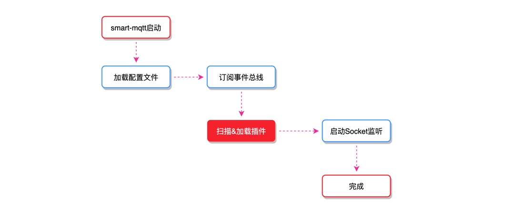
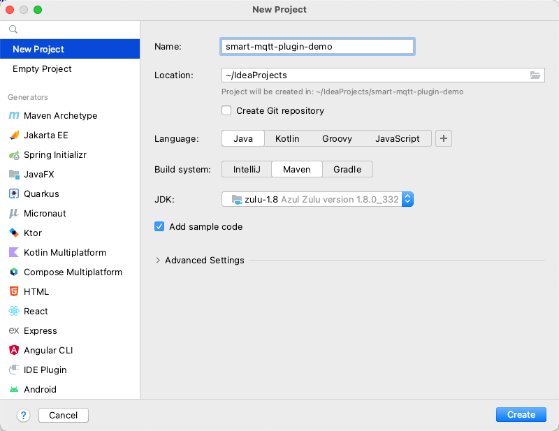
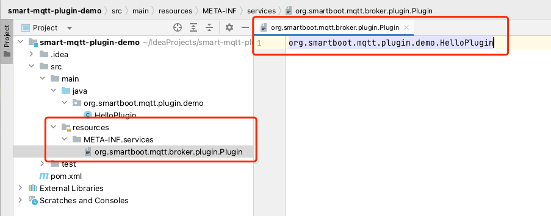
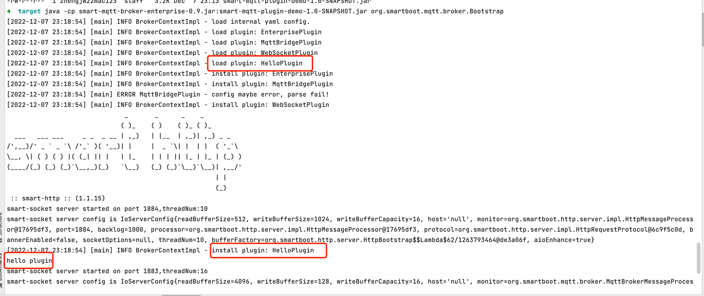

smart-mqtt 是一款非常开放的产品，在满足基本 MQTT 服务的同时，还能基于其插件化的能力衍生出多样化的功能，例如：服务指标统计、集群服务、数据路由等。

smart-mqtt 企业版的几乎每项特性都是一个插件，并且插件与插件之间各自独立自治。

在[事件总线](/smart-mqtt/eventbus.html)章节中为了大家展示了相对细致的 samrt-mqtt 内部架构。
但如果从**插件**视角重新审视 smart-mqtt，则会是另外一番景象（见下图）。

通过订阅事件总线上不同类型的事件，并配套不同的实现策略，可以实现很多实用的功能。当然，你也可以完全脱离事件总线做一些有意思的插件，譬如：插件的热插拔、Broker服务动态启停等。

## 工作原理
我们会持续为企业用户提供丰富且实用性的插件，同时也鼓励具备研发能力的企业通过自研插件支撑业务上需求。

或许在将来，我们会考虑建设一个插件市场，为企业自研的插件提供一个展示、分享的平台，让优质的作品可以惠及全行业。

而此刻，我们先通过以下内容，了解如何开发一个 smart-mqtt 的插件。
### 启动流程
插件，在smart-mqtt中的侵入性是非常低的。如果结合代码的话，你应该能在几分钟内完全掌握它的精髓。


上图为 smart-mqtt 服务启动的完整流程，插件处于其中间环节。插件的启动分为两个步骤：
1. 通过`ServiceLoader`的方式加载`classpath`内的所有插件实例。
2. 按插件的优先级进行排序，再执行`install`方法安装启用插件。
```java
private void loadAndInstallPlugins() {
    for (Plugin plugin : ServiceLoader.load(Plugin.class, Providers.class.getClassLoader())) {
        LOGGER.info("load plugin: " + plugin.pluginName());
        plugins.add(plugin);
    }
    //安装插件
    plugins.stream().sorted(Comparator.comparingInt(Plugin::order)).forEach(plugin -> {
        LOGGER.info("install plugin: " + plugin.pluginName());
        plugin.install(this);
    });
}
```

:::tip
只要遵循 ServiceLoader 模式开发的插件，都能非常轻松的自动扫描并加载进来。
:::

### 退出流程
卸载插件，是 smart-mqtt Broker 停止服务的一个必经过程，以此保证服务的优雅退出和资源的充分释放。

实现的代码也仅仅只有2行：
```java
plugins.forEach(Plugin::uninstall);
plugins.clear();
```
## 演示示例
1. 创建一个插件项目，JDK 为 1.8 的 Maven 工程。


2. 引入 smart-mqtt-broker 的 maven 依赖和`build`插件。
    ```xml
     <dependencies>
        <dependency>
            <groupId>org.smartboot.mqtt</groupId>
            <artifactId>smart-mqtt-broker</artifactId>
            <version>0.9</version>
        </dependency>
    </dependencies>
    <build>
        <plugins>
            <plugin>
                <groupId>org.apache.maven.plugins</groupId>
                <artifactId>maven-compiler-plugin</artifactId>
                <version>3.10.1</version>
                <configuration>
                    <source>1.8</source>
                    <target>1.8</target>
                    <debug>false</debug>
                </configuration>
            </plugin>
            <plugin>
                <artifactId>maven-shade-plugin</artifactId>
                <version>3.3.0</version>
                <executions>
                    <execution>
                        <phase>package</phase>
                        <goals>
                            <goal>shade</goal>
                        </goals>
                        <configuration>
                            <createDependencyReducedPom>false</createDependencyReducedPom>
                            <transformers>
                                <!-- 采用追加的方式 -->
                                <transformer
                                        implementation="org.apache.maven.plugins.shade.resource.AppendingTransformer">
                                    <resource>META-INF/services/org.smartboot.mqtt.broker.plugin.Plugin</resource>
                                </transformer>
                            </transformers>
                        </configuration>
                    </execution>
                </executions>
            </plugin>
        </plugins>
    </build>
    ```
3. 编写插件代码。在`initPlugin`和`destroyPlugin`方法中分别实现该插件的启动和退出逻辑。
   ```java
   package org.smartboot.mqtt.plugin.demo;
   
   import org.smartboot.mqtt.broker.BrokerContext;
   import org.smartboot.mqtt.broker.plugin.Plugin;
   
   public class HelloPlugin extends Plugin {
       @Override
       protected void initPlugin(BrokerContext brokerContext) {
           System.out.println("hello plugin");
       }
   
       @Override
       protected void destroyPlugin() {
           System.out.println("destroy plugin");
       }
   }
   ```
4. 在`resources/META-INF/services`目录下新建文本文件`org.smartboot.mqtt.broker.plugin.Plugin`，并在文件中输入插件实现类的完全包路径：
   ```text
   org.smartboot.mqtt.plugin.demo.HelloPlugin
   ```
   
5. 编译该工程，执行`mvn package`或者`mvn install`皆可。
6. 将原先的 smart-mqtt broker 运行包与本次编译出来的插件包放在同一个目录下。
   
7.  启动 mqtt broker服务。
   ```shell
   java -cp smart-mqtt-broker-enterprise-0.9.jar:smart-mqtt-plugin-demo-1.0-SNAPSHOT.jar org.smartboot.mqtt.broker.Bootstrap
   ```
   