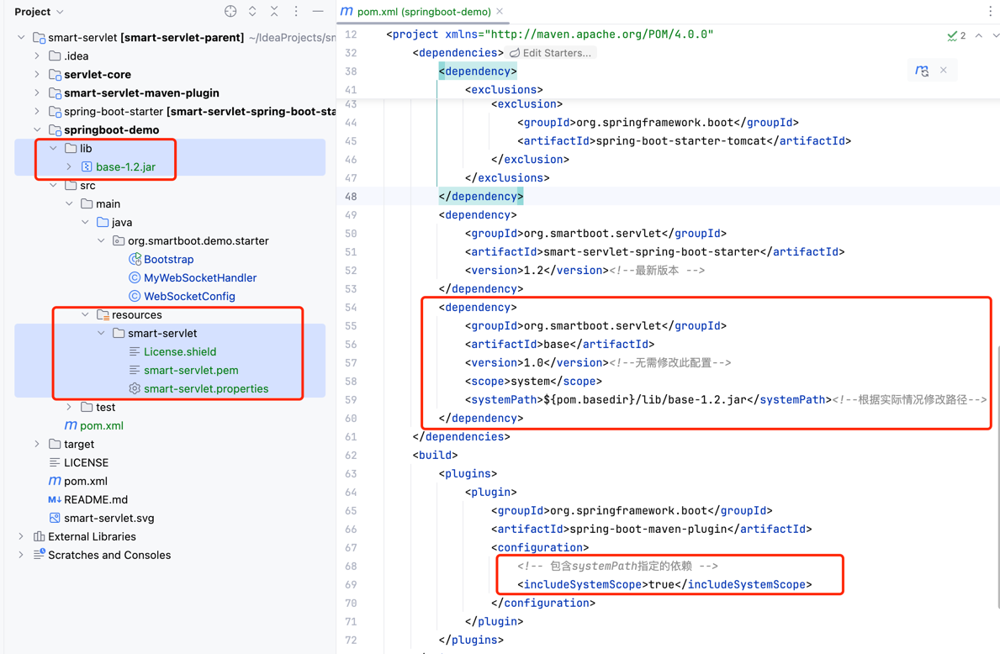

用过 springboot 的 spring-boot-starter-tomcat 或者 spring-boot-starter-undertow 的朋友应该对此不陌生。

smart-servlet-spring-boot-starter 本质上就是 smart-servlet 对 spring-boot-starter-web 的另一种适配。

只需按照以下方式调整 springboot 工程中 pom.xml 文件的配置，便可将 springboot 的默认 Servlet 容器替换成 smart-servlet。

```xml
<dependencys>
    <dependency>
        <groupId>org.springframework.boot</groupId>
        <artifactId>spring-boot-starter-web</artifactId>
        <exclusions>
            <!-- Exclude the Tomcat dependency -->
            <exclusion>
                <groupId>org.springframework.boot</groupId>
                <artifactId>spring-boot-starter-tomcat</artifactId>
            </exclusion>
        </exclusions>
    </dependency>
    <!-- Use smart-servlet instead -->
    <dependency>
        <groupId>org.smartboot.servlet</groupId>
        <artifactId>smart-servlet-spring-boot-starter</artifactId>
        <version>${最新版本号}</version><!--最新版本 -->
    </dependency>
</dependencys>
```
#### 企业版集成
springboot 的企业版在集成上相较于开源版会多出一些额外的步骤。

因为所依赖的企业版 jar 包没有开源，也没有发布到 maven 中央仓库。
用户需要通过官方渠道获取相应的资源包，再导入至本地工程中完成 smart-servlet 企业版的集成。

**步骤一：**

获取 springboot 资源包 **smart-servlet-springboot-${version}.tar.gz** 并解压。
解压后的目录内容如下：


**步骤二：**

拷贝资源文件至你的 springboot 工程内。具体如下：
- lib 目录：拷贝至 springboot 工程目录下。
- smart-servlet 目录：拷贝至 springboot 工程的 `src/main/resources` 路径下。

**步骤三：**
修改springboot工程内的pom.xml文件，添加如下配置：
```xml
 <dependency>
    <groupId>org.smartboot.servlet</groupId>
    <artifactId>base</artifactId>
    <version>1.0</version><!--无需修改此配置-->
    <scope>system</scope>
    <systemPath>${pom.basedir}/lib/base-1.2.jar</systemPath><!--根据实际情况修改路径-->
</dependency>
```
另外，需要在 springboot 打包插件`spring-boot-maven-plugin`中添加配置：`includeSystemScope`，
该配置的作用是在打可执行jar包时，将 smart-servlet 企业版的依赖包也包含进去。
```xml
<build>
    <plugins>
        <plugin>
            <groupId>org.springframework.boot</groupId>
            <artifactId>spring-boot-maven-plugin</artifactId>
            <configuration>
                <!-- 包含systemPath指定的依赖 -->
                <includeSystemScope>true</includeSystemScope>
            </configuration>
        </plugin>
    </plugins>
</build>
```
**自此，便完成了 smart-servlet 企业版的集成。**

