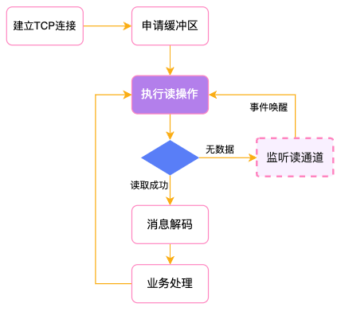

## 模式介绍
低内存模式是 smart-socket 技术创新的成果，**这项特性在目前的 Java AIO 框架中是独一无二的**。

启用该模式后，可以实现通信过程中读缓冲区的按需分配。
在IO空闲期间释放读缓冲区内存，工作期间再申请一定的空间用于接收网络数据包，以此达到提升内存使用率的目的。

## 应用场景
**低内存模式尤其适合运用于海量连接且IO低密集型的场景**。

例如：物联网场景下数十万的设备与服务端建立着长连接，并周期性上报设备数据。

假设每个连接的缓冲区大小是 1MB，对于一般的通信服务而言 10 万个连接将会消耗 9.7G 的内存。
而倘若启用 smart-socket 的低内存模式，这个内存开销或许只有几十兆至几百兆。

:::tip
正是得益于这项技术，我们成功的在一台 8G 内存的服务器中实现了百万级长连接。
感兴趣的朋友可以访问：《[单机百万级长连接背后的故事](/smart-socket/million-connection.html)》
:::

## 实现原理
在讲解低内存模式的运行原理之前，我们有必要对 Java AIO 有一个基本的了解。

`AsynchronousSocketChannel#read`是 Java AIO 用于执行读操作的入口，该接口有三个入参：
1. dst：ByteBuffer缓冲区，用以存放收到的网络数据包。
2. attachment：附件，可以是任意类型的对象。
3. handler：读操作的回调处理器，当发生网络断连或者成功读取到数据后触发。
```java
public abstract class AsynchronousSocketChannel implements AsynchronousByteChannel, NetworkChannel {
    public final <A> void read(ByteBuffer dst, A attachment, CompletionHandler<Integer, ? super A> f) {
        read(dst, 0L, TimeUnit.MILLISECONDS, attachment, handler);
    }
}
```
不得不承认 Java 在 AIO 接口的设计方面还是非常有水平的，它直接将 NIO 这种晦涩难懂又不易驾驭的网络编程技术，
简化至大多数Java程序员都能轻松驾驭的水准。

但是这样的设计存在一个弊端便是对于内存资源的把控无法做到精细化，
在面对海量连接且IO低密集的情况，由于读通道长期处于监听状态，使大量的缓冲区内存处于静默状态（见下图）。


**所以原生的 Java AIO 不太适合这类海量连接的通信场景，但 smart-socket 通过重写通信内核彻底解决了该问题，
成为唯一一款性能和资源开销双优解的通信框架。**

smart-socket 采取的策略便是在无法读到数据时及时释放缓冲区的内存空间，再进入通道监听状态。
直至通道中有数据可读时，再申请一片新缓冲区执行读操作（见下图）。


虽然从流程上是个微小的调整，却是一般 Java AIO 框架所无法实现的功能。 
smart-socket也是在重写底层 AIO 实现后，才有能力感知通道状态并对缓冲区作出优化配置。
```java
void readCompleted(int result) {
    //释放缓冲区
    if (result == EnhanceAsynchronousChannelProvider.READ_MONITOR_SIGNAL) {
        this.readBuffer.clean();
        this.readBuffer = null;
        return;
    }
    if (result == EnhanceAsynchronousChannelProvider.READABLE_SIGNAL) {
        doRead();
        return;
    }
    // 接收到的消息进行预处理
    NetMonitor monitor = config.getMonitor();
    if (monitor != null) {
        monitor.afterRead(this, result);
    }
    this.eof = result == -1;
    this.readBuffer.buffer().flip();
    signalRead();
}
```
smart-socket 定义了两种信号量：
1. READ_MONITOR_SIGNAL
   - 触发条件：当前缓冲区处于清空状态（即无半包）；当前TCP管道中无可读数据。
   - 执行动作：释放读缓冲区内存空间。
2. READABLE_SIGNAL
   - 触发条件：TCP管道数据已就绪，具备可读条件。
   - 执行动作：申请读缓冲区内存空间，并触发读操作。

## 使用指南
由于低内存模式增加了内存释放和再申请两个环节，势必会产生些许的性能损耗。
不过这种损耗仅相对于极限性能压测而言，对实际应用的影响可谓微乎其微。
如果您的应用场景存在较高的连接数，大可放心启用低内存模式。

### 服务端启用方式
服务端启用低内存模式只许在启动时调用`AioQuickServer#setLowMemory`接口，并将入参设置为`true`。
```java
AioQuickServer server = new AioQuickServer(port, protocol, processor);
server.setLowMemory(true);
server.start();
```
### 客户端启用方式
客户端一般没有低内存模式的需求，只有当你的服务内部管理着大量的客户端连接时才有意义。
通常这个时候我们建议这些客户端可以共享线程资源，所以客户端的低内存开关与线程资源组结合在一起。

启用的方式也极为简单，只需在`EnhanceAsynchronousChannelProvider`的构造方法中指定`bool`值便可:
- true: 启用低内存模式
- false: 禁用低内存模式

示例代码如下：
```java
AsynchronousChannelGroup asynchronousChannelGroup = new EnhanceAsynchronousChannelProvider(false).openAsynchronousChannelGroup(Runtime.getRuntime().availableProcessors(), r -> new Thread(r, "ClientGroup"));
AioQuickClient client = new AioQuickClient(host, port, protocol, processor);
AioSession session = client.start(asynchronousChannelGroup);
```