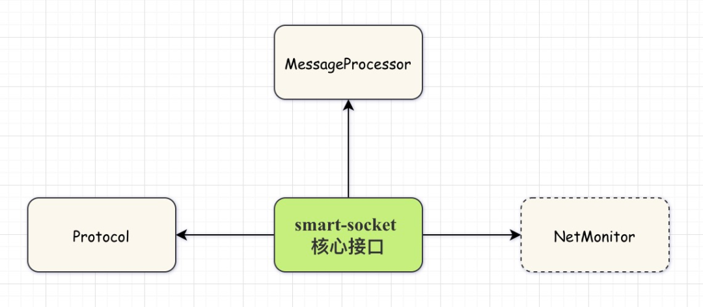
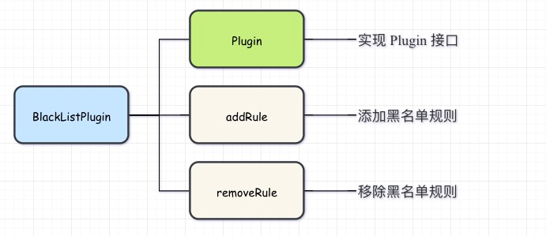
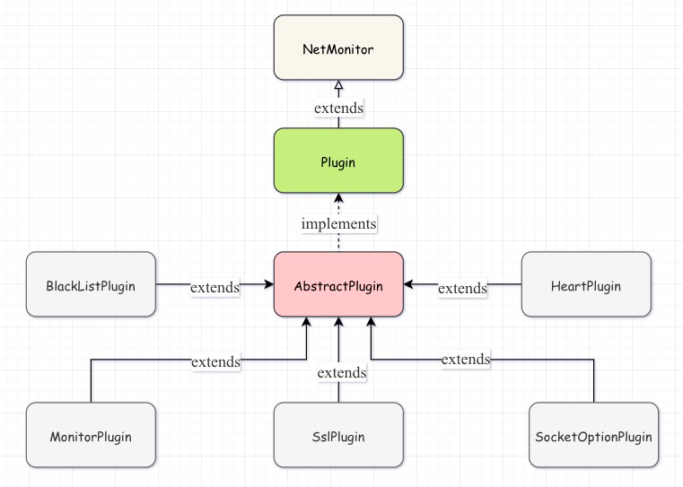
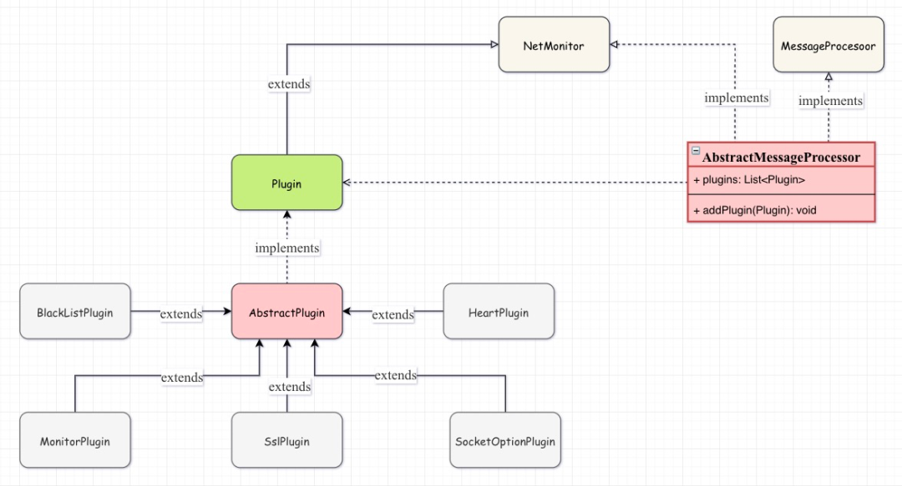

## 前言
NetMonitor 是 smart-socket 三大核心接口中最不为人所关注的一个。但它却是其中功能最强大的，smart-socket 的插件化能力正是从中演化而来。

## Plugin接口设计
NetMonitor 定义的方法主要是针对 I/O 操作相关的切面，当对应的事件即将或已经被执行时，会触发 smart-socket 的回调动作。具体接口设计如下：

仅 NetMonitor 已有的设计，还不足以支撑起插件化功能的各项要求，所以 smart-socket 专门定义了插件接口：Plugin。
该接口继承自 NetMonitor，并新增了两个方法（见下图）。

## 自定义插件
定义插件，说白了就是实现 Plugin 接口。根据你的实际需求，编写 Plugin 各方法的执行逻辑。

除了 Plugin 原有的方法，你还可以在实现类中进一步扩展本插件的方法，以供外部调用。

以 smart-socket 自带的黑名单插件 BlackListPlugin 为例，它不仅实现了 Plugin 定义的方法，还增加了两个方法：
  - addRule：添加黑名单规则
  - removeRule：移除黑名单规则。

当启用这个插件后，凡是匹配黑名单规则的连接请求都将直接被拒绝。

为能够满足不同场景的通信需求，smart-socket 已经内置了一些比较实用的插件，开箱即用：
- BlackListPlugin：黑名单插件，用于拒绝不合规的网络连接。
- HeartPlugin：心跳插件。
- MonitorPlugin：网络监控插件，监控连接数、流量、消息处理情况。
- SslPlugin：TLS/SSL 通信插件。
- SocketOptionPlugin：通道连接属性配置插件。

> 如果你有其他方面的插件需求，可以自己实现 Plugin 接口，或者给我们提需求。

## 启用插件
插件定义出来后，还需将其注册至通信服务中方可生效。这个时候需要依赖实现了 MessageProcessor 接口的抽象类：AbstractMessageProcessor。
> 注意：之前进行通信开发要求实现 MessageProcessor 接口，但如果需要启用插件，必须得继承 AbstractMessageProcessor 类。

调用 AbstractMessageProcessor#addPlugin 方法可以将某个插件注册至通信服务中，
该插件会被存放到 AbstractMessageProcessor 内置的 List 成员变量 plugins，服务启动即可生效。

