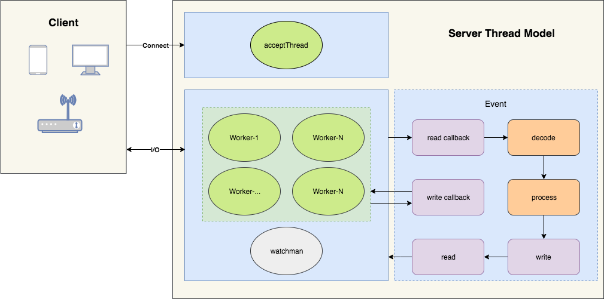

## 快速上手

JDK1.7 是采用 smart-socket 进行开发的最低版本要求，如果您还在用 JDK1.6 或者更低的版本，请先升级您的 JDK。
如果您从事的是 Android 通信开发，可能会面临低版本系统而无法使用 smart-socket 的问题，为此我们专为采用 NIO 技术开发了 Android 版本通信框架 smart-ioc，因其不属于本章主角故暂不多做介绍。
除了JDK，建议事先准备一款顺手的IDE，并搭建好Maven环境，会有更高的开发效率。

smart-socket 并不依赖除 `slf4j-api` 之外的其他第三方 jar 包，所以你可以很轻易的将它集成到你的项目中，无需担心会发生 jar 包冲突的问题。
得益于 smart-socket 代码量极少的特性，你甚至可以选择直接将源码拷贝到自己的项目中，维护一个专属于你的私有版 smart-socket。

目前 smart-socket 托管在码云和Github，有需要的可前往下载项目源码。

- 码云 https://gitee.com/smartboot/smart-socket

- GITHUB https://github.com/smartboot/smart-socket

不过我们更推荐的是采用 maven 方式引用 smart-socket ，这样便可享受由作者提供后续的版本升级服务。

  ```xml
  <!-- 本书中的版本号可能不是最新的，以实际maven仓库中的版本号为准 -->
  <dependency>
      <groupId>org.smartboot.socket</groupId>
      <artifactId>aio-core</artifactId>
      <version>1.4.5</version>
  </dependency>
  ```
 
### 线程模型
用户选择通信框架通常是为了满足服务端的开发，毕竟客户端通信比较简单，即便是传统的BIO都是个性价比较高的选项。所以本书会更侧重于分享 smart-socket 在服务端通信方面的实践，在动手编码之前希望读者朋友先仔细理解下图描绘的 smart-socket 服务端线程模型，对于之后的学习、应用有很大的帮助。



smart-socket 服务端内部设有三类线程：
 - Accept线程     
    接受客户端的连接请求，完成连接会话（AioSession）实例化后便开始监听客户端的数据请求。
 - Worker线程组    
    Worker线程是一组线程池，该线程的职责主要是处理服务端的读写事件。其中读事件的处理会相对复杂，涉及到已读数据的解码（decode）、业务处理（process）和响应数据输出（write）操作。
 - Watchman线程   
    顾名思义，该线程充当监工的角色，监视的对象是Worker线程组待处理的任务。该线程只能处理读回调（read callback）事件，它的存在意义在于激活可能正处于休眠状态的 Worker 线程继续工作。
 
### 内存池
内存池大家应该并不陌生，在 smart-socket 中维护了一套内存池为通信服务提供性能与稳定性的支撑。关于 smart-socket 内存池在后文有详细的介绍，此处先为读者阐述内存池中的几个基本概念以及它们之间的关系，见下图。


- 内存池：BufferPool   
    一个内存池中包含了多个内存页`BufferPage`，为内存申请源提供内存页的分配策略，并且运行着低优先级异步任务将未使用的内存块`chunk`回收至内存页`BufferPage`。
- 内存页：BufferPage    
   其本质就是一个由用户指定大小的 ByteBuffer 对象，DirectByteBuffer 和 HeapByteBuffer 皆可。通过事先初始化足够大小的内存页，服务运行期间可快速响应内存需求。
- 内存块：chunk     
   从 BufferPage 中划分出来的小块内存以满足通信所需，内存块的的申请尽量遵循按需申请，用完即还原则。当内存页中剩余空间不足以满足申请源需求大小时，smart-socket 将向 JVM 申请临时内存块。
 

**线程模型和内存池两者相辅相成，构建出了一个完成的通信内核。熟练掌握并加以合理的应用，所编写的通信服务便会有着非常出色的表现。**

接下里我们正式为大家演示如果运用 smart-socket 进行基本的通信开发。

### 1.1.1 工程搭建

本章以Maven工程为例为大家演示基于smart-socket实现socket开发，如果您已经有现成的工程仅需引入pom.xml依赖即可，否则请先建立一个项目工程。

```xml
<?xml version="1.0" encoding="UTF-8"?>
<project xmlns="http://maven.apache.org/POM/4.0.0"
         xmlns:xsi="http://www.w3.org/2001/XMLSchema-instance"
         xsi:schemaLocation="http://maven.apache.org/POM/4.0.0 
         http://maven.apache.org/xsd/maven-4.0.0.xsd">
    <modelVersion>4.0.0</modelVersion>
    <groupId>org.smartboot.socket</groupId>
    <artifactId>demo</artifactId>
    <version>1.0-SNAPSHOT</version>
    <dependencies>
        <dependency>
            <groupId>org.smartboot.socket</groupId>
            <artifactId>aio-core</artifactId>
            <version>1.4.5</version>
        </dependency>
        <dependency>
            <groupId>org.slf4j</groupId>
            <artifactId>slf4j-simple</artifactId>
            <version>1.7.25</version>
        </dependency>
    </dependencies>
</project>
```

此处我们选用了 smart-socket 目前的最新包：aio-core 1.4.5。出于精简 pom 依赖和不绑架用户对日志框架选择权考虑，smart-socket 非常贴心的仅依赖 slf4j-api，所以开发人员可以自由选择任意的日志框架集成到项目中。例如本次的示例工程我们引入 `slf4j-simple` 依赖以便观察运行时日志。


### 1.1.2 协议约定
工程搭建完毕后，还需适当了解一下通信开发的基础知识：协议。作者接触不少刚开始写通信程序的开发，他们普遍存在的问题是没有正确理解"协议"的概念，以及"协议"在整个通信过程中所扮演的"信息翻译官"这个非常重要的角色。

通信中所说的协议是指双方实体完成通信或服务所必须遵循的规则和约定。
协议定义了数据单元使用的格式，信息单元应该包含的信息与含义，连接方式，信息发送和接收的时序，从而确保网络中数据顺利地传送到确定的地方。

协议的制定，需要满足三要素：

1. 语法：约定通信的数据格式，编码，信号等级
2. 语义：在语法的基础上传递的数据内容
3. 定时规则：明确通信内容的时序

下面我们来定义一套简单的通信协议，并基于该协议实现服务端与客户端的信息交互。如下图所示，每个单元格表示一个Byte，整个消息由两部分组成：

- 消息头：固定一个byte长度
- 消息体：根据消息体中的数值决定消息体长度。当N等于1，消息体长度也则为1；当N等于10，消息体长度则为10。


按照上述规则，我们可以得出一个公式：消息长度=消息头长度+消息体长度，而消息体的长度取决于消息头中的数值。这就是所谓的协议，那根据这个协议，我们如何实现传输呢？

以字符串“socket”为例，按照上述协议进行编码后的结果为：


该协议采用smart-socket可用如下算法实现解码：

1. 标志当前buffer的postion位置；
2. 获取本次消息的消息体长度，position递增1位；
3. 判断当前已读的数据长度是否满足消息体长度；
4. **出现半包，数据不完整，重置标志位，并返回null终止本次解码**；
5. buffer中包含完整的消息体内容，则进行读取，postiton=postion+增加消息体长度;
6. 更新标志位
7. 将已读数据转换为字符串并返回，解码成功。

```java
public class StringProtocol implements Protocol<String> {
    public String decode(ByteBuffer buffer, AioSession<String> session) {
        buffer.mark(); // 1
        byte length = buffer.get(); // 2
        if (buffer.remaining() < length) { // 3
            buffer.reset(); // 4
            return null;
        }
        byte[] body = new byte[length];
        buffer.get(body); // 5
        buffer.mark(); // 6
        return new String(body); // 7
    }
}
```

同样的协议可以有不同的解析算法，不同算法的优劣各不相同。依旧以此协议为例，解析算法还能这样写：

1. 采用绝对定位的方式识别消息长度，该读取方式不会改变buffer的position值；
2. 判断当前buffer中待读取的数据长度是否满足消息体长度；不满足条件说明存在半包情况，返回null；
3. 若消息数据完整，构建用于存放数据的byte数组，通过执行buffer.get()设置数组长度。此get方法会对buffer的position作加1操作。
4. 再次执行buffer.get方法，以byte数组为入参接受消息体数据，此操作也会影响buffer的position；
5. 构建字符串对象，解码成功。

```java
public class StringProtocol implements Protocol<String> {
    @Override
    public String decode(ByteBuffer readBuffer, AioSession<String> session) {
        byte length = readBuffer.get(readBuffer.position());//1
        if (length+1 < readBuffer.remaining()) {//2
            return null;
        }
        byte[] b = new byte[readBuffer.get()];//3
        readBuffer.get(b);//4
        return new String(b);//5
    }
}
```


### 1.1.3 服务端

​启动服务端需要依赖AioQuickServer，实际应用中的运行参数调优也都是对AioQuickServer的接口进行操作，
此处先展示一下它的基本应用。

1. 构造服务端对象AioQuickServer。该类的构造方法有以下几个入参：
   - port，服务端监听端口号，客户度要请求该端口号才可连上服务端。
   - Protocol，协议解码类，将ByteBuffer中已读部分的byte数据还原成消息实体
   - MessageProcessor，消息处理器，对Protocol解析出来的消息进行业务处理
2. 启动Server服务

```java
public class Server {
    public static void main(String[] args) throws IOException {
        // 1
        AioQuickServer<String> server = new AioQuickServer<String>(8080, new StringProtocol(), new MessageProcessor<String>() {
            public void process(AioSession<String> session, String msg) {
                System.out.println("接受到客户端消息:" + msg);

                byte[] response = "Hi Client!".getBytes();
                byte[] head = {(byte) response.length};
                try {
                    session.writeBuffer().write(head);
                    session.writeBuffer().write(response);
                } catch (IOException e) {
                    e.printStackTrace();
                }
            }

            public void stateEvent(AioSession<String> session, StateMachineEnum stateMachineEnum, Throwable throwable) {
            }
        });
        //2
        server.start();
    }
}
```

上述代码中启动了端口号8080的服务端应用，当接收到客户端发送过来的数据时，服务端以StringProtocol进行协议解码，识别出客户度传递的字符串，随后将该消息转交给消息处理器MessageProcessor进行业务处理。

### 1.1.4 客户端

客户端的开发相较于服务端就简单很多，仅需操作一个连接会话（AioSession）即可，而服务端面向的是众多连接会话，在实际运用中还得具备并发思维与会话资源管理策略。客户端的开发步骤通常如下：

1. 连接服务端，取得连接会话（AioSession）
2. 发送请求消息
3. 处理响应消息
4. 关闭客户端

```java
public class Client {
    public static void main(String[] args) throws InterruptedException, ExecutionException, IOException {
        AioQuickClient<String> client = new AioQuickClient<String>("127.0.0.1", 8080, new StringProtocol(), new MessageProcessor<String>() {
            public void process(AioSession<String> session, String msg) {
                System.out.println(msg);
            }

            public void stateEvent(AioSession<String> session, StateMachineEnum stateMachineEnum, Throwable throwable) {
            }
        });

        AioSession<String> session = client.start();
        byte[] msgBody = "Hello Server!".getBytes();
        byte[] msgHead = {(byte) msgBody.length};
        try {
            session.writeBuffer().write(msgHead);
            session.writeBuffer().write(msgBody);
            session.writeBuffer().flush();
        } catch (IOException e) {
            e.printStackTrace();
        }
    }
}
```

### 1.1.5 启动运行

完成代码的编写后我们便可先后启动服务端、客户端程序，观察通信服务的运行结果。服务端启动成功后，会在控制台打印如下信息，如启动失败请检查是否存在端口被占用的情况。


​	接下来我们再启动客户端程序，客户端启动成功后会直接发送一个“Hello Server!”的消息给服务端，并通过消息处理器(MessageProcessor)打印所接受到的服务端响应消息“Hi Client!”。


至此，我们采用 smart-socket 顺利完成了简易的通信服务。如果对本章节某个知识点还不甚清楚，建议反复阅读加深理解或者上网搜索同类信息。当然，跟着示例动手敲一遍代码也是个不错的学习方式。