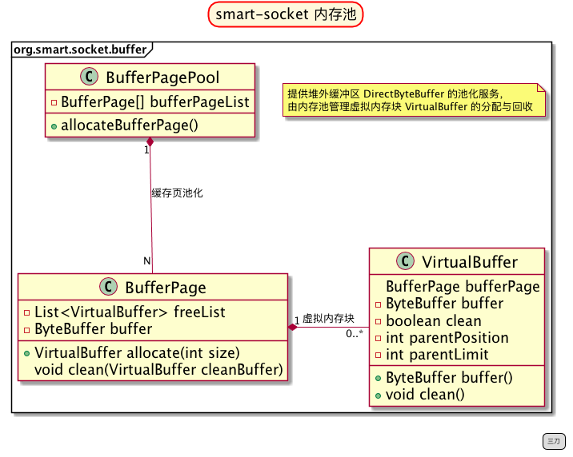

# 第四章 内存池



内存池似乎已经当下各个牛逼框架的标配，我们也专门为smart-socket度身打造了一款内存池解决方案。当然我们并不是为了盲目跟风，确实是有一些问题需要通过该项技术得以解决，并且smart-socket的内存池表现非常令人满意。在此跟大家分享一下smart-socket内存池的设计理念，但愿能与读者朋友产生共鸣。

smart-socket引入内存池设计，主要为了解决两个问题：零拷贝、对象复用。

- 零拷贝；

  接触过Netty的朋友应该都听说过该项技术，这项技术的原理也很简单。在数据传输时，如果存储数据的ByteBuffer是堆内缓冲区对象HeapByteBuffer，则在输出时JVM会将该缓冲区的数据拷贝到堆外的直接缓冲区DirectByteBuffer再输出，该场景就存在一次内存拷贝。而如果一开始我们就将数据写入直接缓冲区DirectByteBuffer，则无需进行数据拷贝便可输出数据，这就是所谓的零拷贝，而零拷贝所带来的好处就是节省了临时内存和CPU的消耗，以下便是JVM执行数据输出的处理方式，阅读源码有助于读者朋友更深刻的理解零拷贝。

  ```java
  static int write(FileDescriptor var0, ByteBuffer var1, long var2, NativeDispatcher var4) throws IOException {
          if (var1 instanceof DirectBuffer) {
              return writeFromNativeBuffer(var0, var1, var2, var4);
          } else {
              int var5 = var1.position();
              int var6 = var1.limit();
  
              assert var5 <= var6;
  
              int var7 = var5 <= var6 ? var6 - var5 : 0;
              ByteBuffer var8 = Util.getTemporaryDirectBuffer(var7);
  
              int var10;
              try {
                  var8.put(var1);
                  var8.flip();
                  var1.position(var5);
                  int var9 = writeFromNativeBuffer(var0, var8, var2, var4);
                  if (var9 > 0) {
                      var1.position(var5 + var9);
                  }
                  var10 = var9;
              } finally {
                  Util.offerFirstTemporaryDirectBuffer(var8);
              }
              return var10;
          }
      }
  ```


- 复用对象；

  实现对象的复用一方面可以节省对象构造造成的时间成本，另一方面可以大大减少运行过程中产生的对象数，缓解GC压力。特别对于直接缓冲区DirectByteBuffer对象，不仅创建耗时长，而且因其存在于堆外内存中导致无法通过垃圾回收器释放内存，非常适合通过池化管理提升对象复用率。

## 4.1 设计原理

​	smart-socket内存池的设计原理比较简单，事先在堆外内存中申请一个大的DirectByteBuffer，后续使用时通过DirectByteBuffer映射出实际所需大小的虚拟Buffer于堆内空间中。所以这VirtualBuffer其实就是堆外内存在堆内内存中创建的一个索引，smart-socket在堆内空间中对VirtualBuffer的一切数据读写操作都会同步反应至堆外的DirectByteBuffer中。


<center>图4-1-1</center>

接下来通过几张图示范一下内存池的运作流程。例如：

1. 我们需要一块长度为2的ByteBuffer，那么我们就映射出一个VirtualBuffer占用堆外内存中的两个字节空间。

2. 之后我们还需要一块长度为4的ByteBuffer，那就只能申请下标3至6的空间。

   

   <center>图4-1-2</center>

3. 当虚拟内存使用完毕后，要及时释放占用的堆外内存。

   

   <center>图4-1-3</center>

4. 下一次再需要空间时继续从可用空间中申请。

   

<center>图4-1-4</center>

​	通过不断的申请、释放，smart-socket内存池便运转起来了。需要注意的事，内存的申请是从头到尾进行扫描，而释放回收是无时序的，如图4-1-4。所以在实际运行中会产生一些不连续的小内存块，也就是内存碎片。内存碎片化是个必然存在的状况，假如这种小颗粒内存碎片占比增高，会降低虚拟内存申请的成功率。如果虚拟内存申请失败，smart-socket内存池会启用备用方案,采用申请堆内缓冲区的方式满足应用所需，此类缓冲区使用完毕后可由垃圾回收器释放。这样一种堆外为主，堆内为辅的设计方案，保障了smart-socket内存池的稳定、高效。

## 4.2 内存池实践

​	前文讲完了smart-socket内存池的设计原理，但在实践中还会面临一个情况，便是内存分配、回收时面临的并发问题。尽管只需加同步锁控便能解决，但是在高并发场景下的锁竞争会比较激烈，为了缓解这一状况。smart-socket内存池中引入了内存页BufferPage的概念。内存池中创建一组BufferPage，每个BufferPage各自封装一个大的DirectByteBuffer。再根据特定的分配策略将网络会话AIOSession与某个BufferPage关联起来，由此降低并发情况下的锁竞争压力。


​	最终我们的smart-socket内存池实现如下所示。初始化内存池时需要指定内存页的个数，为每个内存页分配的空间大小，以及是否使用直接缓冲区。至于内存页的分配，采用的是轮训策略。

```java
public class BufferPagePool {
    private BufferPage[] bufferPageList;
    /**
     * 内存页游标
     */
    private int cursor = -1;

    /**
     * @param pageSize 内存页大小
     * @param poolSize 内存页个数
     * @param isDirect 是否使用直接缓冲区
     */
    public BufferPagePool(final int pageSize, final int poolSize, final boolean isDirect) {
        bufferPageList = new BufferPage[poolSize];
        for (int i = 0; i < poolSize; i++) {
            bufferPageList[i] = new BufferPage(pageSize, isDirect);
        }
    }

    /**
     * 申请内存页
     *
     * @return
     */
    public BufferPage allocateBufferPage() {
        //轮训游标，均衡分配内存页
        cursor = (cursor + 1) % bufferPageList.length;
        BufferPage page = bufferPageList[cursor];
        return page;
    }

}
```

## 4.3 总结

​	smart-socket内存池的设计可能在理论层面的探讨会更有意义，它所带来的性能提升和内存优化，很轻易的就会被实际业务场景下的系统业务抵消掉。而smart-socket花费大量精力设计的内存池，是为了达到实验室环境下的最优解。框架层面做的每一次努力，都是期望让更多的硬件资源服务于用户的业务，提升资源利用率。


