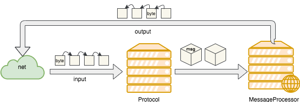

## 核心接口与状态机

业界有句话叫“一流的卖标准、二流的卖技术、三流的卖产品”，如果说 smart-socket 的技术价值仅算二流水准的话，那么我们为其精心设计的接口期望能稍微提升一下它的档次。

smart-socket的学习成本主要集中在两个接口`Protocol`、`MessageProcessor`和一个状态机`StateMachineEnum`。
接口定义了数据处理规则，而状态机则是事件一种通知机制。

###一、核心接口
这两个核心接口在通信流程中的职责如下： 
- Protocol：负责解析网络中传输过来的字节流，将其转换成消息实体，并传递至 MessageProcessor 进行业务处理。
- MessageProcessor：处理接受到的网络消息，并在必要时候输出消息至对端。


当然，你也可以在 Protocol 中一次性完成解析、业务处理；
又或者将 Protocol 当个摆设，所有事情集中在 MessageProcessor 完成。
smart-socket 不限制你实现功能的自由性，只是提供一个更规范、更合理的建议，最终决定权还是在用户的手中。


#### Protocol

```java
public interface Protocol<T> {
    T decode(final ByteBuffer readBuffer, AioSession<T> session);
}
```

Protocol 是一个泛型接口，`<T>`指的是业务消息实体类，smart-socket 中不少地方都运用了泛型设计，其含义都代表数据解码后封装的消息类型。

decode（消息解码），AIO 的数据传输是以 ByteBuffer 为媒介的。所有读取到的字节数据都会填充在 ByteBuffer 中并以事件回调的形式触发 Protocol#decode() 方法。所以我们实现的 decode 算法就是 ByteBuffer 对象转化为业务消息`<T>`的过程。

需要强调一点，读者朋友请不要把解码想的很简单，令人“深恶痛绝”的半包/粘包就是在这个环节需要应对的。
大家不要寄希望于框架自动解决半包/粘包问题，因为这个问题的解决是靠你的解码算法去做容错的。
如果哪个框架宣称解决了此问题，那边通常有两种情况： 
1. 你所需的协议是由该框架提供的，它的解码算法确实能兼容了半包/粘包情况。
2. 框架提供了一种宽松内存策略，确保你能接受到一个完整的包。

无论何种情况，对个人而言都不是一件好事。
在你没有理解半包/粘包的出现场景和应对策略之前，过渡依赖框架的只会限制你对通信的认知，也会增加与内行人士的沟通难道。

#### MessageProcessor

```java
public interface MessageProcessor<T> {

    /**
     * 处理接收到的消息
     *
     * @param session 通信会话
     * @param msg     待处理的业务消息
     */
    void process(AioSession<T> session, T msg);

    /**
     * 状态机事件,当枚举事件发生时由框架触发该方法
     *
     *
     * @param session          本次触发状态机的AioSession对象
     * @param stateMachineEnum 状态枚举
     * @param throwable        异常对象，如果存在的话
     * @see StateMachineEnum
     */
    void stateEvent(AioSession<T> session, StateMachineEnum stateMachineEnum, Throwable throwable);
}
```

smart-socket 在通过 Protocol 完成消息解码后，会将消息对象交由 MessageProcessor 实现类进行业务处理。

- process
  消息处理器，smart-socket 每接收到一个完整的业务消息，都会交由该处理器执行。
- stateEvent
  执行状态机，smart-socket 内置了状态枚举`StateMachineEnum`。`MessageProcessor`实现类可在此方法中处理其关注的事件。

### 状态机StateMachineEnum
smart-socket 中引入了状态机的概念，状态机的存在不会决策 smart-socket 对于通信的事件处理，但会在特定事件发生之时通知消息处理器`MessageProcessor#stateEvent`。目前已有的状态枚举为：

| 状态枚举          | 说明                                                         |
| ----------------- | ------------------------------------------------------------ |
| NEW_SESSION       | 网络连接建立时触发，连接建立时会构建传输层的AioSession，如果业务层面也需要维护一个会话，可在此状态机中处理 |
| INPUT_SHUTDOWN    | 数据读取完毕时触发，即传统意义中的`read()==-1`               |
| INPUT_EXCEPTION   | 读数据过程中发生异常时触发此状态机                           |
| OUTPUT_EXCEPTION  | 写数据过程中发生异常时触发此状态机                           |
| SESSION_CLOSING   | 触发了AioSession.close方法，但由于当前AioSession还有未完成的事件，会进入SESSION_CLOSING状态 |
| SESSION_CLOSED    | AioSesson完成close操作后触发此状态机                         |
| PROCESS_EXCEPTION | 业务处理异常                                                 |
| DECODE_EXCEPTION  | 解码异常 |
| REJECT_ACCEPT     | 服务端拒绝客户端连接请求 |

状态机贯穿了通信服务的整个生命周期，在这个过程中不同事件的发生会触发不同的状态机。通信事件与状态机的关系如下图所示。


<center>图2.2.2</center>

状态机相对于整个通信环境的各个节点只是一个旁观者，它见证了各个事件的发生，却无力扭转事件的发展方向。

状态机的本质跟大家所认知的过滤器、拦截器有点类似，那为什么smart-socket要如此设计呢？想想一下如果我们按照过滤器的设计思路，其形态会如下所示：

```java
public interface Filter{
    void newSession(AioSesion session);
    void processException(AioSession session,Throwable throwable);
    void decodeExcepton(AioSession session,Throwable throwable);
    void inputException(AioSession session,Throwable throwable);
    void outputException(AioSession session,Throwable throwable);
    void sessionClosing(AioSession session);
    void sessionClosed(AioSession session);
}
```

这样的设计存在以下缺陷：

1. 对实现类不友好；也许我只想处理 newSession，却不得不保留其余方法的空实现；
2. 无法平滑升级；加入新版本中加入新的事件类型，老版本代码需要全部更改；

而采用状态机模式，不仅解决了上述问题，还为通信服务的多元化扩展带了便利。
例如 IM 场景下，我们在 NEW_SESSION 状态机中收集 Session 集合，在消息处理时很容易就能实现消息群发；
当某个用户断线后，我们及时在状态机 SESSION_CLOSED 中感知到并更新 Session 集合中的会话状态，甚至可以群发消息给所有用户“某某人掉线了”。这些通信状态和业务相结合的场景， 用状态机能很好的得以解决。最后奉上一段粗糙的伪代码，读者自行领悟。

```java
public class IMProcessor implements MessageProcessor<Message> {
    private LinkedBlockingQueue sessions = new LinkedBlockingQueue();

    public void process(AioSession<String> session, Message msg) {
        for(AioSession otherSession:sessions){
            if(otherSession==session){
                continue;
            }
            sendMessage(otherSession,session+"群发送消息："+msg);
        }
    }

    public void stateEvent(AioSession<Message> session, StateMachineEnum state, Throwable throwable) {
        switch (state) {
            case NEW_SESSION:
                sessions.add(session);
                break;
            case SESSION_CLOSED:
                sessions.remove(session);
                break;
        }
    }
}
```